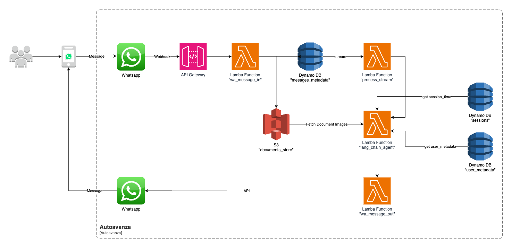

# Nacional Monte de Piedad Automatizacion con IA del Proyecto AutoAvanza

El objetivo principal es desarrollar una prueba de concepto de inteligencia artificial que permita automatizar el proceso de alta de documentos del producto AutoAvanza y otorgar mayor autonomía al cliente desde las plataformas digitales de Nacional Monte de Piedad. Esto permitirá generar una preoferta confiable de forma más rápida y efectiva, ayudando a cerrar la brecha entre la solicitud inicial y la formalización del crédito.


## Prueba de concepto

1. Toma de fotos
2. Carga a plataforma
3. Extracción de datos
4. Cotejo de información
5. Dictamen documental
6. Pre-oferta


## Estructura del Proyecto

La estructura del proyecto esta definida de la siguiente forma:

```
project_root/
├── data/
│   ├── bronze/
│   ├── silver/
│   └── gold/
├── notebooks/
└── src/
    ├── models/
    └── pipelines/
```

- En la carpeta `notebooks` se deben almacenar los documentos de colab o jupyter notebooks
- En la carpeta `data` se deben almacenar los datos con los cuales trabajaremos y tiene diferentes divisiones:
   - `bronze` estan los datos en crudo
   - `silver` estan los datos pre-procesados
   - `gold` estan los datos listos para consumo de un algoritmo de ml
- En la carpeta `src/pipelines` se deben almacenar los scripts de python para ejecutar el entrenamiento o preprocesamiento de los datos
- En la carpeta `src/models` se deben almacenar los archivos de python que contienen las arquitecturas desarrolladas


## Entornos de python (opcional)

Para crear un entorno de python es necesario tener instalado python de forma global o tener instalado anaconda, conda, poetry, etc.

### Usando virtualenv

Ejecutar los commandos
 
```python
# installs the dependency
pip install virtualenv
# creates a new environment
virtualenv venv
# activates the environment
source venv/bin/activate
```

### Dependencias

Para instalar las dependencias del proyecto se pueden usar los siguientes commandos

```python
pip install -r requirements.txt
```

y también si usas poetry usar

```python
poetry install --no-root
```


## Arquitectura de la Solución



1. El usuario inicia una conversación en WhatsApp
2. Whatsapp invoca la función lambda "wa_message_in" y almacena el mensaje en una tabla de dynamo db si el mensaje contiene una imagen se almacena en un bucket S3
3. La función lambda "process_stream" recive los eventos del stream e invoca la función "lang_chain_agent"
4. La función lambda "lang_chain_agent" procesa el mensaje, obtiene los documentos del bucket s3, valida siguiendo ciertas reglas predefinidas, y se invoca al modelo de machine learning.
5. La función lambda "lang_chain_agent" invoca "wa_message_out" para devolver una respuesta al usuario mediante la API de whatsapp.